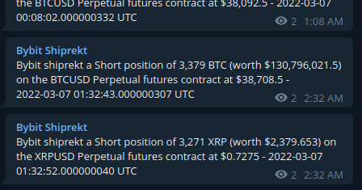

# bybit-shiprekt
Inspired by Kraken Shiprekt Telegram group, but this is for Bybit.

It reports liquidation events as occurred on futures market on Bybit exchange into
telegram channel group called ["Bybit Shiprekt"](https://t.me/bybit_shiprekt).

You can use this code to spin your own, or just subscribe to such telegram channel group
as mentioned.



# Liquidation note

By subscribing to liquidation websocket of Bybit, the value computed from
the data received of such position **might not** reflect the full total value of
the original position of trader. Because Bybit applies the partial liquidation
to lower the position of trader (if possible); until it is not possible
then the entire position will be taken by the liquidation engine to be settled
at the brankruptcy price (which is the price as notified by liquidation websocket).

Also USDT contracts (linear contract) doesn't use ADL (Auto-deleveraging), but
inverse contracts do.

Read more at

* Liquidation process (USDT contract) - [article](https://help.bybit.com/hc/en-us/articles/900000167723-Liquidation-Process-USDT-Contract-#:~:text=Bybit%20uses%20mark%20price%20to,level%2C%20the%20position%20is%20liquidated.)
* Liquidation process (Inverse contract) - [article](https://help.bybit.com/hc/en-us/articles/360039261474-Liquidation-process-Inverse-Contract-)
* ADL (Auto-Deleveraging) - [article](https://help.bybit.com/hc/en-us/articles/900000031623-What-is-Auto-Deleveraging-ADL-)

Anyhow, the lowest risk level is already huge in amount of value. Thus it should
cover most of the liquidation case from traders thus reflect the true value
of the position.

# Set up

* Define environment variables of the following
    * `HX_BYBIT_SHIPREKT_TELEGRAM_BOT_TOKEN` - telegram bot token used to relay the message to the target telegram channel
    * `HX_BYBIT_SHIPREKT_TELEGRAM_CHANNEL_CHAT_ID` - telegram channel's chat id to relay the liquidation messages to
* Build and run this program in the background.

# Legacy note

You can ignore this, it is kept just for historical purpose.

The legacy note extracted from old version of source code after migrated away
from polling mechanism to async way through `tokio-tungstenite`.

```
/**
* Please note that I've spent much of the time trying to make mio's Poll works
* with tungstenite with "native-tls" feature to work together. Unfortunately,
* up until now, I didn't find an answer yet.
*
* See my question on Rust forum if you can help answering it:
* https://users.rust-lang.org/t/tls-websocket-how-to-make-tungstenite-works-with-mio-for-poll-and-secure-websocket-wss-via-native-tls-feature-of-tungstenite-crate/72533?u=haxpor
*
* There are also choice whether we will go with async, or sync way.
* Clearly I want to go with blocking approach, non-async, as simple as possible
* first for this program. Although you can go with tokio-tungstenite for async
* way but it's too overkill for me at this point. I would like it to be lightweight
* as much as possible (for now).
*
*/
```

Before the project migrated to just use `tokio-tungstenite` I've tried to go
minimally and attempted to make `tungstenite` works with `mio`'s `Poll` but
due to the complexity of setting up stream, and its compatibility, the attempt
was not success. So I have to cut out option of using `mio` in order to make it
work in non-async way. With that we have option to set timeout of underlying
stream, or make it non-blocking. Either way could work, but still it means it
operates in polling way.

Anyway for now, the project is in async way.

# Disclaimer

Use this program at your own risk. I take no responsibility towards damage or loss from using it
as a tool to aid in the investment. Please consider this program and its source code as educational purpose that might be useful for your case and situation at hands. Please kindly do your due diligence.

# License
MIT, Wasin Thonkaew
